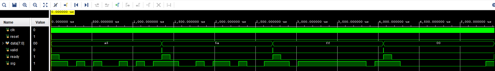
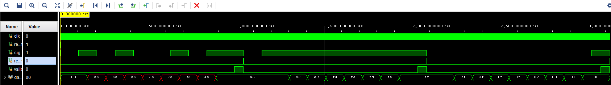
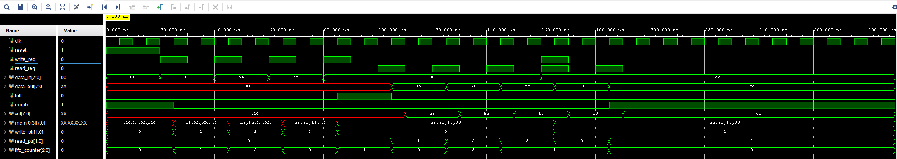

# UART with FIFO
This project implements a configurable and modular UART (Universal Asynchronous Receiver Transmitter) system enhanced with synchronous FIFO (First-In-First-Out) buffers for both transmit (TX) and receive (RX) paths. It is written in synthesizable SystemVerilog and designed for ease of reuse and testing in FPGA-based communication systems.

## Features
- **Configurable UART Transmitter & Receiver**
  - Parameterized data bits, parity, stop bits, and baud rate
  - Supports optional even/odd parity
- **Synchronous FIFO Buffers**
  - TX FIFO buffers outgoing data
  - RX FIFO stores received bytes
- **Modular Design**
  - uart_tx, uart_rx, and sync_fifo are independently testable and reusable
  - FIFO RAM abstracted to infer block RAM in synthesis
- **Handshaking Interface**
  - Follows `valid`/`ready` protocol for control
- **Testbenches**
  - TBs for UART TX, RX, and FIFO to validate functionality

## Simulation
Tool used: Vivado XSIM
Simulation duration: 10 ms

## Results

### UART Transmitter
Sends serial data frames with correct start, data, optional parity, and stop bits.

---
### UART Receiver
Receives and reconstructs bytes from the serial stream, with optional parity checking.

---
### Synchronous FIFO
Stores and forwards bytes between UART and application logic using full/empty flags.

## License
This project is licensed under the MIT License.
